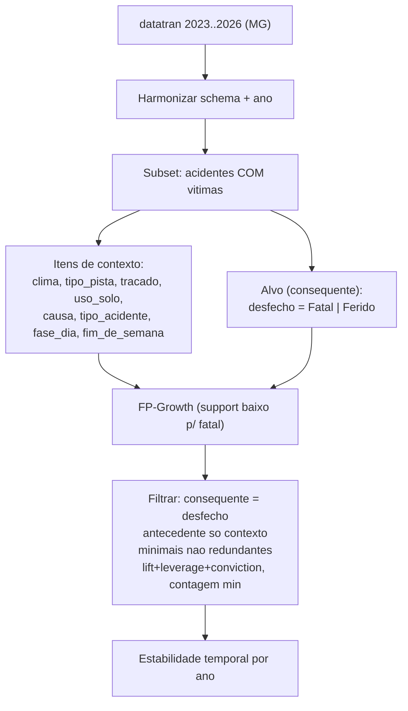

## Diagnostico (por que esta trivial)

As regras de maior lift sao tautologicas/definicionais, nao descobertas:

- `gravidade_binaria` e copia deterministica de `classificacao_acidente`; as duas juntas geram `lift=14.1` falso.
- Variaveis temporais sobrepostas (`dia_semana`, `fim_de_semana`, `faixa_horaria`, `fase_dia`) geram regras de calendario.
- Classe majoritaria (`Nao Fatal` = 92,9%) domina; nenhuma regra preve fatalidade a partir de contexto.
- `min_support=5%` sobre 2.985 registros torna padroes contextuais->fatal (evento ~7%) inalcancaveis.
- Bugs de contagem mascaram o problema (`gravidade_binaria=Fatal` vs item real `_Fatal`; substring `'Fatal'` casa `Nao Fatal`).

Conclusao: e **metodologico**, amplificado por volume. A solucao combina **redesenho (Pacote A)** + **MG multi-ano (2023+)**.

## Desenho novo da mineracao




Decisoes-chave:

- Manter **apenas uma** variavel de gravidade (remover `gravidade_binaria` dos itens; criar alvo `desfecho`).
- Restringir a **acidentes com vitimas** (Fatal vs Ferido), removendo `Sem Vitimas`.
- **Deduplicar temporais**: manter `fase_dia` (luminosidade) + `fim_de_semana`; remover `faixa_horaria` e `dia_semana` cru dos itens.
- Gravidade entra **so como consequente** (mineracao restrita pos-filtro).

## Mudancas por arquivo

### 1. [notebooks/01_setup_e_carregamento.ipynb](notebooks/01_setup_e_carregamento.ipynb) - multi-ano

- Trocar `DATASETS['por_ocorrencia']['file']` por suporte a lista de anos, ex.:

```python
ANOS = [2023, 2024, 2025, 2026]  # 2026 parcial (flag)
ARQUIVOS_OCORRENCIA = {a: f'datatran{a}.csv' for a in ANOS}
```

- Nova funcao `carregar_anos(anos, filtro_uf='MG')` que le cada `datatran<ano>.csv`, adiciona coluna `ano`, concatena e filtra UF.
- Etapa de **harmonizacao**: padronizar nomes de colunas, normalizar strings categoricas (strip/Title), unificar valores de `uso_solo`, `condicao_metereologica`; manter `sep=';'`, `encoding='latin-1'`.
- Acao do usuario: baixar `datatran2023.csv`, `datatran2024.csv`, `datatran2025.csv` do portal de Dados Abertos da PRF para [data/](data/) (o `2026` parcial ja existe localmente).

### 2. [notebooks/03_preparacao_dados.ipynb](notebooks/03_preparacao_dados.ipynb) - correcao central

- Subset com vitimas: `df = df[df['classificacao_acidente'] != 'Sem Vitimas']`.
- Criar alvo unico:

```python
df['desfecho'] = (df['classificacao_acidente'] == 'Com Vitimas Fatais').map({True:'Fatal', False:'Ferido'})
```

- `COLUNAS_TRANSACIONAIS` de contexto = `condicao_metereologica, tipo_pista, tracado_via, uso_solo, causa_acidente, tipo_acidente, fase_dia, fim_de_semana` (remover `classificacao_acidente`, `gravidade_binaria`, `faixa_horaria`, `dia_semana` cru).
- One-hot de contexto + item de alvo separado; persistir `transacional_contexto.pkl`, `alvo.pkl`, e `ano` para split temporal.
- Reduzir `min_freq` (ex.: 0.5%) ja que ha mais dados, capturando contexto mais raro.

### 3. [notebooks/04_modelagem.ipynb](notebooks/04_modelagem.ipynb) - mineracao restrita + evento raro + poda

- FP-Growth com `min_support` baixo (ex.: 0.01) sobre contexto+alvo; gerar regras.
- **Filtrar** regras: `consequente == {desfecho_Fatal}` (e separadamente `Ferido`), `antecedente` apenas itens de contexto.
- **Poda de redundancia**: remover regras nao minimais (se um subconjunto do antecedente ja da confianca >= para o mesmo consequente).
- Ranking por **lift + leverage + conviction** e exigir **contagem absoluta minima** (ex.: >=30).
- Corrigir bugs de nome de item e substring `'Fatal'`.
- Clustering: manter K-Means como complementar **sobre contexto** (sem alvo) e adicionar comparacao **estratificada direta urbano vs rural via `uso_solo`** para H5 (mais interpretavel que k=2 fraco).

### 4. Estabilidade temporal (diretriz Monitoramento) - em [notebooks/04](notebooks/04_modelagem.ipynb) ou [notebooks/05](notebooks/05_avaliacao_ia_responsavel.ipynb)

- Rodar a mineracao fatal-foco **por ano**; medir recorrencia de cada regra; classificar **estavel (>=50% dos anos)** vs **transitoria (<30%)**; reportar evolucao de lift/confianca.

### 5. [notebooks/05_avaliacao_ia_responsavel.ipynb](notebooks/05_avaliacao_ia_responsavel.ipynb) - explicabilidade

- Traduzir as top regras **contexto->fatal** nao triviais para linguagem natural com suporte/confianca/lift + disclaimer associacao != causalidade.
- Tabela de estabilidade temporal.
- Corrigir bugs de traducao/contagem.

### 6. [notebooks/06_visualizacao_resultados.ipynb](notebooks/06_visualizacao_resultados.ipynb)

- Atualizar figuras: rede de regras contexto->fatal; evolucao de lift por ano; scatter suporte x confianca; perfis urbano vs rural.

## Validacao de sucesso

- Top regras passam a ter **antecedentes contextuais** e consequente de gravidade (nao swaps de gravidade).
- Existem regras contexto->`Fatal` com lift > 1, contagem suficiente e interpretabilidade.
- Pelo menos algumas regras **estaveis** entre anos.
- Sumario quantitativo (nº de regras nao triviais, top por lift) reportavel no relatorio final.

## Observacoes

- Mantem o **metodo principal unico** (FP-Growth / regras de associacao) exigido pela [especificacao_projeto_md.md](especificacao_projeto_md.md) e pela [Proposta_Projeto_Grupo18.md](Proposta_Projeto_Grupo18.md).
- Reforca as **duas diretrizes** (Explicabilidade + Monitoramento) com a estabilidade temporal multi-ano.
- Recorte fora do padrao default e aceito com justificativa tecnica (iteracao CRISP-DM).

